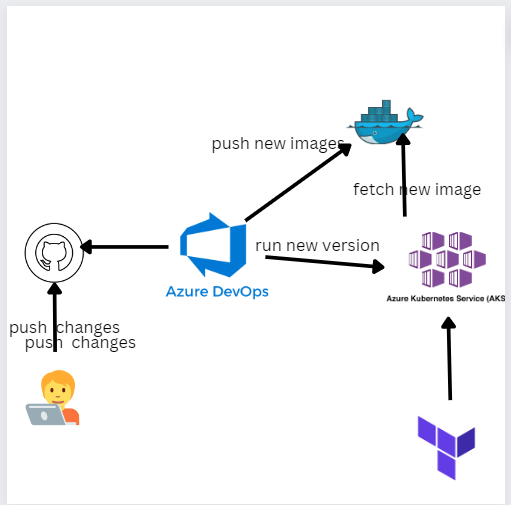

# Automating the Deployment of a Web App to Azure Kubernetes Service using Azure DevOps and Terraform

This project seeks to create a Continuous Integration/Continuous Delivery (CI/CD) pipeline using Azure DevOps to deploy a web application created with Streamlit to an Azure Kubernetes Service (AKS) cluster provisened with Terraform.

The project consists of the following steps:

1. Provisioning of an Azure Kubernetes Service (AKS) cluster using Terraform.
2. Setting up of the Azure DevOps environment to create a CI/CD pipeline.
3. Creating a Streamlit web application.
4. Configuring the CI/CD pipeline to build and deploy the Streamlit web application to the AKS cluster.
5. Testing the web application to ensure it is functioning properly.

This provide a reliable and efficient approach to deploying applications quickly and easily.

  

## Built With
- Azure Devops
- Terrafrom
- Kubernetes (AKS)
- Docker

## Authors
Bendra Abdelali
- [Profile](https://github.com/bendraabdelali)
- [Linkedin](https://www.linkedin.com/in/abdelali-bendra-934755182/)
- [Kaggle](https://www.kaggle.com/bendraabdelali)
