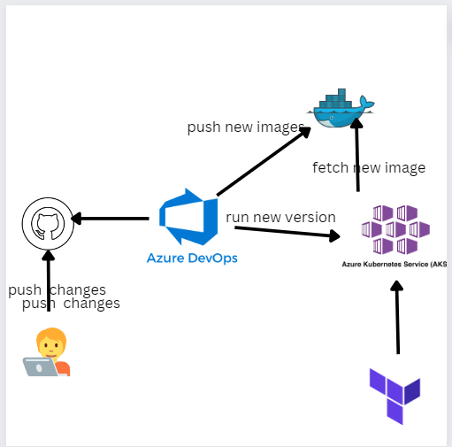
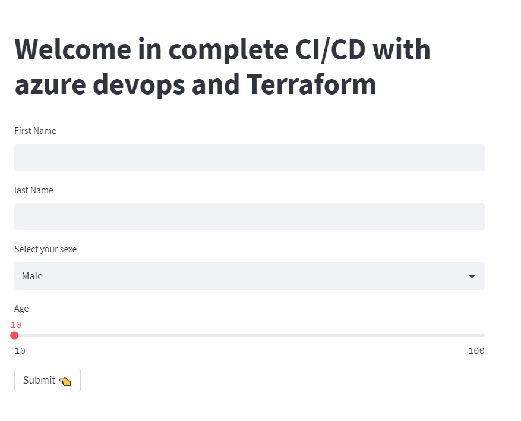

# k8s-CI-Cd-azure-Devops


In this project we will create :  
- 1- Create a Kubernetes cluster with Azure Kubernetes Service using Terraform
- 2-pipeline that continuously builds and deploys our  app using  Azure Pipelines. Every time you change your code in a repository that contains a Dockerfile, the images are pushed to your DockerHub (we can alse use any container registry like Azure Container Registry ), and the manifests are then deployed to your AKS cluster.<br>
Azure Pipelines lets you build, test, and deploy with continuous integration (CI) and continuous delivery (CD) using Azure DevOps.




##  Prerequisites

To run this project, you will need :
- [`Azure Account`](https://azure.microsoft.com/en-us/free/?WT.mc_id=A261C142F) 
- [`Azure Devops Account`](https://azure.microsoft.com/en-us/products/devops/)
- [`Azure Cli`](https://learn.microsoft.com/en-us/cli/azure/install-azure-cli)
- [`Terrafrom`](https://developer.hashicorp.com/terraform/tutorials/aws-get-started/install-cli)
- [`Kubectl`](https://kubernetes.io/docs/tasks/tools/)

## Usage
### 1- Create a Kubernetes cluster with Terraform 
Create a Kubernetes cluster with
first go and run House_predict_.ipynb to create model.joblib 
 ```bash
  cd IaC
  az login
  Terraform apply 
  mv kubeconfig ~/.kube/config
```
Verify the health of the cluster
 ```bash
  kubectl get nodes
```
### 2- Create the pipeline
- Sign in to your Azure DevOps organization and go to your project.

- Go to Pipelines, and then select New pipeline,select GitHub, enter your GitHub credentials. select repository that you forked.
- choose  Existing Azure Piplines Yaml file for Configure your pipeline and choose azure-devops.yaml file  
- Select Project settings > Service connections .
- Select + New service connection, select the type of service connection that you need, and then select Next. in this project we need two first connection to Docker Hub (for the name give Dockerhub ) and second connection into Aks (give aks-cred as the name of the connection )

### 2- Run or Save  piplines . 
### 3-Acces app
Verify the deployment added 
 ```bash
  kubectl get deployment
  kubectl get service devops-service 
```
### EXTERNAL-IP:8501





## Built With
- Azure Devops
- Terrafrom
- Kubernetes
- Azure
- Docker
- Streamlit


## Authors
Bendra Abdelali
- [Profile](https://github.com/bendraabdelali)
- [Linkedin](https://www.linkedin.com/in/abdelali-bendra-934755182/)
- [Kaggle](https://www.kaggle.com/bendraabdelali)